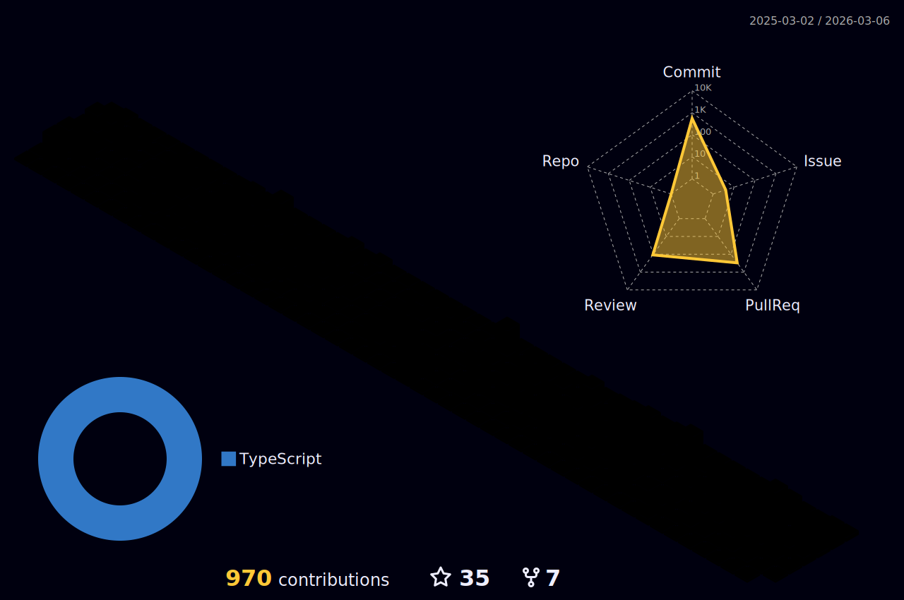

## Hi there 👋, I'm Roberto!

I'm a full-stack software engineer specializing in **Node**, **JavaScript**, **TypeScript**, **React**, and **React Native**, but I'm open to working with any technology that makes sense for the project.

Before being a **full-stack engineer** building web apps, I see myself as a developer, and even before that, as a problem solver. I love digging deep into domains and coming up with practical solutions tailored to each project’s specifics.

Being full-stack means I'm ready to build end-to-end solutions. But I consider myself a bit different—I prefer using straightforward tools to quickly push high-quality code to production, with CI, tests, and other quality checks. At the same time, I enjoy the creative side of development and can handle UX/UI work using tools like Figma.

I'm always focused on balancing cost and value in any system. I aim to close the gap between business and tech. First and foremost, I’m a problem solver.

I'm not actively looking for a new position right now, but I'm always up for a chat.

🤘 If you’re a recruiter, a good way to grab my attention? Start by telling me your favorite rock band at robertooliveira.dev@gmail.com.

---

<!--
**IsTheJack/IsTheJack** is a ✨ _special_ ✨ repository because its `README.md` (this file) appears on your GitHub profile.

Here are some ideas to get you started:

- 🔭 I’m currently working on ...
- 🌱 I’m currently learning ...
- 👯 I’m looking to collaborate on ...
- 🤔 I’m looking for help with ...
- 💬 Ask me about ...
- 📫 How to reach me: ...
- 😄 Pronouns: ...
- ⚡ Fun fact: ...
-->

